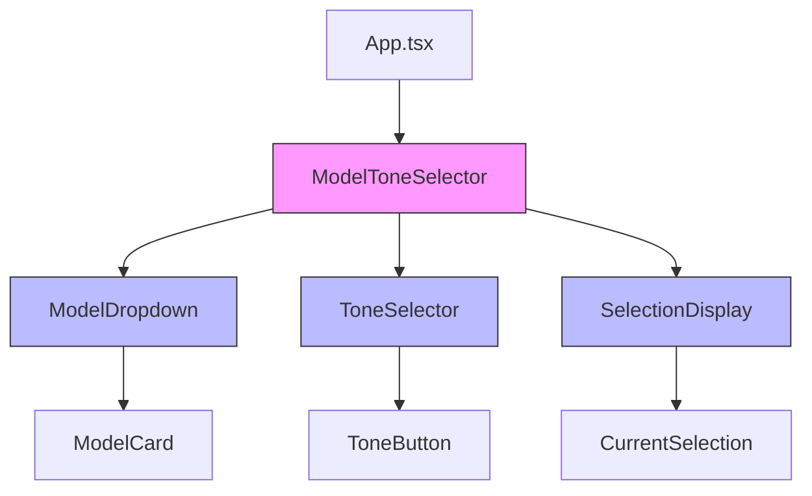
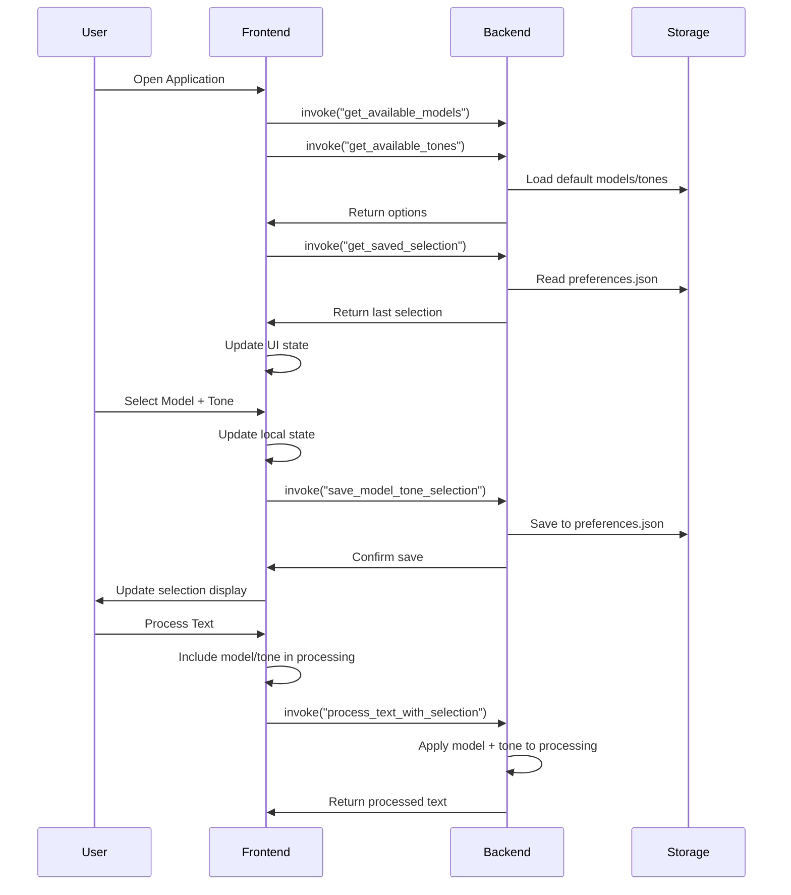

# Model-Tone Selector Feature Design

## Overview

This feature enhances the Clipify desktop application by adding an intuitive interface for users to select both AI models and communication tones for text processing. The selection options are dynamically populated from the Rust backend, providing flexibility to add new models and tones without frontend changes.

## Technology Stack & Dependencies

- **Frontend**: React 19 with TypeScript
- **Backend**: Rust with Tauri commands
- **State Management**: React hooks (useState, useEffect)
- **UI Components**: Custom CSS components with responsive design
- **Data Flow**: Tauri invoke/listen pattern for frontend-backend communication

## Component Architecture

### Backend Data Structures

```rust
#[derive(Debug, Clone, Serialize, Deserialize)]
pub struct ModelOption {
    pub id: String,
    pub name: String,
    pub description: String,
    pub provider: String, // "clipify", "openai", "anthropic", "local", etc.
    pub is_available: bool,
    pub capabilities: Vec<String>, // "text-cleanup", "formatting", "rewriting", etc.
    pub processing_speed: ProcessingSpeed, // Fast, Medium, Slow
    pub requires_api_key: bool,
    pub icon: String, // Icon identifier for UI
}

#[derive(Debug, Clone, Serialize, Deserialize)]
pub enum ProcessingSpeed {
    Fast,    // < 100ms
    Medium,  // 100ms - 1s
    Slow,    // > 1s
}

#[derive(Debug, Clone, Serialize, Deserialize)]
pub struct ToneOption {
    pub id: String,
    pub name: String,
    pub description: String,
    pub example_keywords: Vec<String>,
    pub is_default: bool,
    pub category: ToneCategory,
    pub emoji: String, // Visual indicator
}

#[derive(Debug, Clone, Serialize, Deserialize)]
pub enum ToneCategory {
    Business,   // Professional, Formal, Corporate
    Creative,   // Friendly, Casual, Engaging
    Technical,  // Precise, Detailed, Concise
}

#[derive(Debug, Clone, Serialize, Deserialize)]
pub struct ModelToneSelection {
    pub model_id: String,
    pub tone_id: String,
    pub timestamp: DateTime<Utc>,
    pub usage_count: u32, // Track popularity
    pub is_favorite: bool,
}

// Enhanced ClipboardEntry to include processing metadata
#[derive(Debug, Clone, Serialize, Deserialize)]
pub struct EnhancedClipboardEntry {
    // Existing fields from ClipboardEntry
    pub id: String,
    pub content: String,
    pub original_content: String,
    pub is_cleaned: bool,
    pub timestamp: DateTime<Utc>,
    pub char_count: usize,
    pub line_count: usize,
    pub has_formatting: bool,
    pub content_type: String,
    pub preview: String,
    
    // New model-tone processing fields
    pub processing_model: Option<String>,
    pub processing_tone: Option<String>,
    pub processing_duration_ms: Option<u64>,
    pub quality_score: Option<f32>, // 0.0 - 1.0 processing quality
}
```

### Frontend Component Hierarchy



### Component Definitions

#### ModelToneSelector Component
- **Purpose**: Main container component managing model and tone selection state
- **Props**: 
  - `onSelectionChange: (model: ModelOption, tone: ToneOption) => void`
  - `disabled?: boolean`
- **State**:
  - `models: ModelOption[]`
  - `tones: ToneOption[]`
  - `selectedModel: ModelOption | null`
  - `selectedTone: ToneOption | null`
  - `isLoading: boolean`

#### ModelDropdown Component
- **Purpose**: Dropdown selector for AI models with search and filtering
- **Props**:
  - `models: ModelOption[]`
  - `selectedModel: ModelOption | null`
  - `onModelSelect: (model: ModelOption) => void`
  - `disabled?: boolean`
- **Features**:
  - Search functionality for model names
  - Provider-based grouping
  - Availability status indicators

#### ToneSelector Component
- **Purpose**: Grid-based tone selection with visual preview
- **Props**:
  - `tones: ToneOption[]`
  - `selectedTone: ToneOption | null`
  - `onToneSelect: (tone: ToneOption) => void`
  - `disabled?: boolean`
- **Layout**: Responsive grid showing tone cards with descriptions

#### SelectionDisplay Component
- **Purpose**: Clear visual confirmation of current selections
- **Props**:
  - `selectedModel: ModelOption | null`
  - `selectedTone: ToneOption | null`
- **Features**: Compact summary with model provider and tone characteristics

## Backend Architecture

### Tauri Commands

```rust
#[tauri::command]
async fn get_available_models() -> Result<Vec<ModelOption>, String>

#[tauri::command]
async fn get_available_tones() -> Result<Vec<ToneOption>, String>

#[tauri::command]
async fn save_model_tone_selection(
    selection: ModelToneSelection,
    preferences_state: tauri::State<'_, PreferencesState>
) -> Result<(), String>

#[tauri::command]
async fn get_saved_selection(
    preferences_state: tauri::State<'_, PreferencesState>
) -> Result<Option<ModelToneSelection>, String>
```

### Data Persistence

```rust
#[derive(Debug, Serialize, Deserialize)]
pub struct UserPreferences {
    pub last_model_selection: Option<ModelToneSelection>,
    pub favorite_models: Vec<String>,
    pub custom_tones: Vec<ToneOption>,
}

// Storage location: ~/Library/Application Support/Clipify/preferences.json
```

## API Integration Layer

### Frontend Service Pattern

```typescript
// services/modelToneService.ts
export class ModelToneService {
  static async getAvailableModels(): Promise<ModelOption[]>
  static async getAvailableTones(): Promise<ToneOption[]>
  static async saveSelection(model: ModelOption, tone: ToneOption): Promise<void>
  static async getSavedSelection(): Promise<ModelToneSelection | null>
}
```

### State Management Integration

```typescript
// Custom hook for model-tone selection
export function useModelToneSelection() {
  const [models, setModels] = useState<ModelOption[]>([]);
  const [tones, setTones] = useState<ToneOption[]>([]);
  const [selectedModel, setSelectedModel] = useState<ModelOption | null>(null);
  const [selectedTone, setSelectedTone] = useState<ToneOption | null>(null);
  const [isLoading, setIsLoading] = useState(false);

  // Load data on mount and handle selection persistence
  return {
    models, tones, selectedModel, selectedTone, isLoading,
    selectModel, selectTone, loadSavedSelection
  };
}
```

## User Interface Design

### Layout Integration
The model-tone selector will be integrated into the main App.tsx as a new section above the text processing area:

```
┌─────────────────────────────────────┐
│ Global Shortcut Status              │
├─────────────────────────────────────┤
│ Model & Tone Selection              │
│ ┌─────────────┐ ┌─────────────────┐ │
│ │Model Dropdown│ │  Tone Grid      │ │
│ │             │ │ [Prof][Friend]  │ │
│ │             │ │ [Formal][Casual]│ │
│ │             │ │ [Brief][Detail] │ │
│ └─────────────┘ └─────────────────┘ │
│ Current: GPT-4 + Professional       │
├─────────────────────────────────────┤
│ Text Processing Area                │
└─────────────────────────────────────┘
```

### Styling Strategy

Following Clipify's corporate-friendly design principles with modern glassmorphism effects:

```css
:root {
  --clipify-primary: #6366f1;
  --clipify-secondary: #a855f7;
  --clipify-success: #22c55e;
  --clipify-surface: rgba(255, 255, 255, 0.1);
  --clipify-border: rgba(255, 255, 255, 0.2);
  --clipify-text: #1f2937;
  --clipify-text-muted: #6b7280;
}

.model-tone-selector {
  background: var(--clipify-surface);
  backdrop-filter: blur(10px);
  border: 1px solid var(--clipify-border);
  border-radius: 16px;
  box-shadow: 0 8px 32px rgba(0, 0, 0, 0.1);
  padding: 1.5rem;
  margin-bottom: 1.5rem;
  transition: all 0.3s cubic-bezier(0.4, 0, 0.2, 1);
}

.model-dropdown {
  min-width: 220px;
  position: relative;
  background: rgba(255, 255, 255, 0.05);
  border-radius: 12px;
  transition: transform 0.2s ease, box-shadow 0.2s ease;
}

.model-dropdown:hover {
  transform: translateY(-2px);
  box-shadow: 0 12px 24px rgba(0, 0, 0, 0.15);
}

.tone-grid {
  display: grid;
  grid-template-columns: repeat(auto-fit, minmax(120px, 1fr));
  gap: 0.75rem;
  flex: 1;
}

.tone-button {
  padding: 0.75rem 1rem;
  border: 2px solid transparent;
  border-radius: 8px;
  background: linear-gradient(135deg, 
    rgba(99, 102, 241, 0.1) 0%, 
    rgba(168, 85, 247, 0.1) 100%);
  color: var(--clipify-text);
  font-weight: 500;
  text-align: center;
  cursor: pointer;
  transition: all 0.3s cubic-bezier(0.4, 0, 0.2, 1);
  position: relative;
  overflow: hidden;
}

.tone-button::before {
  content: '';
  position: absolute;
  top: 0; left: 0; right: 0; bottom: 0;
  background: linear-gradient(135deg, var(--clipify-primary), var(--clipify-secondary));
  opacity: 0;
  transition: opacity 0.3s ease;
  z-index: -1;
}

.tone-button:hover {
  transform: translateY(-2px);
  border-color: var(--clipify-primary);
}

.tone-button.selected {
  border-color: var(--clipify-primary);
  color: white;
  box-shadow: 0 4px 16px rgba(99, 102, 241, 0.3);
}

.tone-button.selected::before {
  opacity: 0.8;
}

.selection-display {
  background: linear-gradient(135deg, 
    rgba(34, 197, 94, 0.1) 0%, 
    rgba(59, 130, 246, 0.1) 100%);
  border: 1px solid rgba(34, 197, 94, 0.2);
  padding: 1rem;
  border-radius: 8px;
  font-size: 0.9rem;
  color: var(--clipify-text);
  text-align: center;
  margin-top: 1rem;
  animation: slideInFromBottom 0.5s ease-out;
}

@keyframes slideInFromBottom {
  from {
    opacity: 0;
    transform: translateY(20px);
  }
  to {
    opacity: 1;
    transform: translateY(0);
  }
}

/* Responsive Design */
@media (max-width: 768px) {
  .model-tone-selector {
    padding: 1rem;
    flex-direction: column;
  }
  
  .model-dropdown {
    min-width: 100%;
    margin-bottom: 1rem;
  }
  
  .tone-grid {
    grid-template-columns: repeat(2, 1fr);
  }
}

@media (max-width: 480px) {
  .tone-grid {
    grid-template-columns: 1fr;
  }
}
```

## Data Flow Architecture



## Testing Strategy

### Unit Tests

```typescript
// tests/ModelToneSelector.test.tsx
describe('ModelToneSelector', () => {
  test('loads models and tones on mount')
  test('handles model selection')
  test('handles tone selection')
  test('persists selection to backend')
  test('displays current selection clearly')
  test('handles loading states')
  test('handles error states')
})
```

### Integration Tests

```rust
// src-tauri/src/tests/model_tone_tests.rs
#[cfg(test)]
mod tests {
    #[test]
    fn test_get_available_models()
    
    #[test]
    fn test_get_available_tones()
    
    #[test]
    fn test_save_and_load_selection()
    
    #[test]
    fn test_preferences_persistence()
}
```

### End-to-End Tests

- Model dropdown functionality and search
- Tone selection with visual feedback
- Selection persistence across app restarts
- Integration with text processing workflow
- Accessibility compliance testing

## Enhanced UI Design & Branding

### Glassmorphism Integration

Following Clipify's modern design direction, the model-tone selector incorporates glassmorphism effects:

```css
.model-tone-selector {
  background: rgba(255, 255, 255, 0.1);
  backdrop-filter: blur(10px);
  border: 1px solid rgba(255, 255, 255, 0.2);
  border-radius: 16px;
  box-shadow: 0 8px 32px rgba(0, 0, 0, 0.1);
  padding: 1.5rem;
  margin-bottom: 1.5rem;
}

.model-dropdown-container {
  background: rgba(255, 255, 255, 0.05);
  backdrop-filter: blur(5px);
  border-radius: 12px;
  transition: all 0.3s cubic-bezier(0.4, 0, 0.2, 1);
}

.model-dropdown-container:hover {
  background: rgba(255, 255, 255, 0.1);
  transform: translateY(-2px);
  box-shadow: 0 12px 24px rgba(0, 0, 0, 0.15);
}
```

### Gradient Integration

```css
.tone-button {
  background: linear-gradient(135deg, 
    rgba(99, 102, 241, 0.1) 0%, 
    rgba(168, 85, 247, 0.1) 100%);
  border: 2px solid transparent;
  background-clip: padding-box;
  position: relative;
}

.tone-button::before {
  content: '';
  position: absolute;
  top: 0; left: 0; right: 0; bottom: 0;
  background: linear-gradient(135deg, #6366f1, #a855f7);
  border-radius: inherit;
  z-index: -1;
  opacity: 0;
  transition: opacity 0.3s ease;
}

.tone-button.selected::before {
  opacity: 0.2;
}
```

### Animation Effects

```css
@keyframes slideInFromLeft {
  from {
    opacity: 0;
    transform: translateX(-20px);
  }
  to {
    opacity: 1;
    transform: translateX(0);
  }
}

@keyframes pulse {
  0%, 100% { transform: scale(1); }
  50% { transform: scale(1.05); }
}

.model-card {
  animation: slideInFromLeft 0.5s ease-out;
}

.selection-confirmed {
  animation: pulse 0.6s ease-in-out;
}

.tone-button:hover {
  animation: bounce 0.3s ease;
  transform: translateY(-2px);
}
```

## Integration with Existing Features

### Text Processing Enhancement

```rust
#[tauri::command]
async fn process_text_with_model_tone(
    text: String,
    model_id: String,
    tone_id: String,
    history_state: tauri::State<'_, ClipboardHistoryState>,
    preferences_state: tauri::State<'_, PreferencesState>
) -> Result<String, String> {
    // Apply base cleanup first (existing cleanup_text function)
    let base_cleaned = cleanup_text(&text);
    
    // Apply model-specific processing
    let model_processed = match model_id.as_str() {
        "gpt-4" => apply_gpt4_processing(&base_cleaned, &tone_id).await?,
        "local-llama" => apply_local_processing(&base_cleaned, &tone_id)?,
        "basic" => base_cleaned, // Fallback to basic cleanup
        _ => return Err("Unsupported model".to_string()),
    };
    
    // Save to clipboard history with model/tone metadata
    let entry = ClipboardEntry {
        content: model_processed.clone(),
        original_content: text,
        is_cleaned: true,
        processing_model: Some(model_id),
        processing_tone: Some(tone_id),
        ..ClipboardEntry::new(model_processed.clone(), true, Some(text))
    };
    
    {
        let mut history = history_state.write().await;
        history.add_entry(entry);
        save_history_to_file(&*history)?;
    }
    
    Ok(model_processed)
}
```

### Global Shortcut Integration

```rust
// Enhanced global shortcut handler with model-tone selection
.with_handler(|app, shortcut, event| {
    let app_handle = app.clone();
    tauri::async_runtime::spawn(async move {
        let history_state = app_handle.state::<ClipboardHistoryState>();
        let preferences_state = app_handle.state::<PreferencesState>();
        
        // Get current model-tone selection
        let selection = match get_saved_selection(preferences_state).await {
            Ok(Some(sel)) => sel,
            _ => ModelToneSelection {
                model_id: "basic".to_string(),
                tone_id: "professional".to_string(),
                timestamp: Utc::now(),
            }
        };
        
        match copy_and_process_with_selection(
            app_handle.clone(), 
            history_state, 
            preferences_state,
            selection
        ).await {
            Ok(text) => {
                // Show enhanced notification with model info
                let notification_body = format!(
                    "Processed with {} ({}): {}", 
                    selection.model_id,
                    selection.tone_id,
                    if text.len() > 40 { 
                        format!("{}...", &text[..40]) 
                    } else { 
                        text 
                    }
                );
                
                if let Err(e) = tauri_plugin_notification::NotificationExt::notification(&app_handle)
                    .builder()
                    .title("🧹 Text Cleaned!")
                    .body(&notification_body)
                    .show() {
                    eprintln!("Failed to show notification: {}", e);
                }
            },
            Err(e) => eprintln!("Error processing text: {}", e),
        }
    });
})
```

## Configuration & Customization

### Default Models Configuration

```rust
// Default models with Clipify-specific capabilities
fn get_default_models() -> Vec<ModelOption> {
    vec![
        ModelOption {
            id: "basic".to_string(),
            name: "Basic Cleanup".to_string(),
            description: "Clipify's standard text cleaning".to_string(),
            provider: "clipify".to_string(),
            is_available: true,
            capabilities: vec!["whitespace-cleanup".to_string(), "line-break-normalization".to_string()],
        },
        ModelOption {
            id: "enhanced".to_string(),
            name: "Enhanced Processing".to_string(),
            description: "Advanced formatting and structure".to_string(),
            provider: "clipify".to_string(),
            is_available: true,
            capabilities: vec!["structure-detection".to_string(), "smart-formatting".to_string()],
        },
        ModelOption {
            id: "gpt-4".to_string(),
            name: "GPT-4 Pro".to_string(),
            description: "AI-powered professional rewriting".to_string(),
            provider: "openai".to_string(),
            is_available: false, // Requires API key configuration
            capabilities: vec!["rewriting".to_string(), "tone-adjustment".to_string()],
        }
    ]
}
```

### Corporate-Focused Tones

```rust
fn get_default_tones() -> Vec<ToneOption> {
    vec![
        ToneOption {
            id: "professional".to_string(),
            name: "Professional".to_string(),
            description: "Formal business communication".to_string(),
            example_keywords: vec!["formal".to_string(), "corporate".to_string()],
            is_default: true,
        },
        ToneOption {
            id: "concise".to_string(),
            name: "Concise".to_string(),
            description: "Brief and to-the-point".to_string(),
            example_keywords: vec!["brief".to_string(), "direct".to_string()],
            is_default: false,
        },
        ToneOption {
            id: "detailed".to_string(),
            name: "Detailed".to_string(),
            description: "Comprehensive with full context".to_string(),
            example_keywords: vec!["thorough".to_string(), "complete".to_string()],
            is_default: false,
        },
        ToneOption {
            id: "friendly".to_string(),
            name: "Friendly".to_string(),
            description: "Warm yet professional".to_string(),
            example_keywords: vec!["approachable".to_string(), "warm".to_string()],
            is_default: false,
        }
    ]
}
```

### Smart Card Layout Implementation

```css
.model-tone-grid {
  display: grid;
  grid-template-columns: 1fr 2fr;
  gap: 1.5rem;
  align-items: start;
}

@media (max-width: 768px) {
  .model-tone-grid {
    grid-template-columns: 1fr;
    gap: 1rem;
  }
}

.model-selection-card {
  background: rgba(255, 255, 255, 0.08);
  border-radius: 12px;
  padding: 1.25rem;
  border: 1px solid rgba(255, 255, 255, 0.1);
}

.tone-selection-card {
  background: rgba(255, 255, 255, 0.08);
  border-radius: 12px;
  padding: 1.25rem;
  border: 1px solid rgba(255, 255, 255, 0.1);
}

.selection-status-card {
  grid-column: 1 / -1;
  background: linear-gradient(135deg, 
    rgba(34, 197, 94, 0.1) 0%, 
    rgba(59, 130, 246, 0.1) 100%);
  border: 1px solid rgba(34, 197, 94, 0.2);
  border-radius: 8px;
  padding: 1rem;
  text-align: center;
  margin-top: 1rem;
}
```

### System Tray Integration

```rust
// Add model-tone quick actions to system tray menu
let model_tone_menu = tauri::menu::Submenu::with_id_and_items(
    app,
    "model_tone",
    "🎯 Quick Model & Tone",
    true,
    &[
        &tauri::menu::MenuItem::with_id(app, "basic_professional", "Basic + Professional", true, None::<&str>)?,
        &tauri::menu::MenuItem::with_id(app, "enhanced_concise", "Enhanced + Concise", true, None::<&str>)?,
        &tauri::menu::MenuItem::with_id(app, "basic_friendly", "Basic + Friendly", true, None::<&str>)?,
    ]
)?;
```

### Extension Points

The architecture supports future Clipify enhancements:
- **API Integration**: OpenAI, Anthropic, and other AI service connectors
- **Custom Tone Profiles**: User-defined tones for specific industries
- **Batch Processing**: Apply model-tone combinations to clipboard history
- **Keyboard Shortcuts**: Quick selection via customizable hotkeys
- **Export Presets**: Save and share model-tone configurations
- **Usage Analytics**: Track most effective model-tone combinations