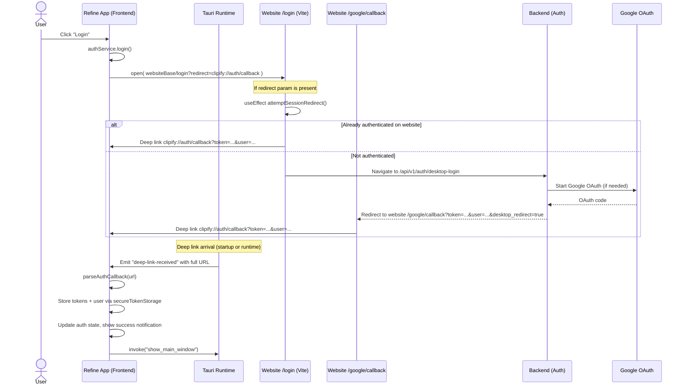

# Clipify Desktop Authentication Flow (refine ⇄ website)

This document describes the complete desktop authentication flow for the Tauri app in `refine/`, centralized through the website in `website/`. It covers routing between components, state/session handling, error handling, and security considerations. It also includes troubleshooting and known gaps.

References used while authoring this doc:
- Desktop: `refine/src/services/authService.ts`, `refine/src/services/environmentService.ts`, `refine/src/hooks/useAuth.ts`, `refine/src/services/secureTokenStorage.ts`, `refine/src/services/authenticatedApiClient.ts`, `refine/src/services/tokenRefreshService.ts`, `refine/src-tauri/src/lib.rs`, `refine/src-tauri/tauri.conf.json`
- Website: `website/src/pages/Login.tsx`, `website/src/pages/GoogleCallback.tsx`, `website/src/features/auth/context/AuthContext.tsx`
- Prior changes/decisions summarized in project memories


## Flow at a glance




## Step 1 — Desktop initiates login

The desktop app uses a website-centralized flow.

- **Trigger**: Any component that calls `useAuth().login()`.
- **Implementation**: `refine/src/services/authService.ts` `login()` opens the website login page with a redirect param pointing back to the app’s deep link.

```ts
// refine/src/services/authService.ts
public async login(): Promise<void> {
  this.updateAuthState({ isLoading: true, error: null });

  const config = getEnvironmentConfig();
  const websiteBase = (config.frontend.baseUrl || '').replace(/\/$/, '');
  const redirectUri = config.oauth.redirectUri; // e.g., clipify://auth/callback
  const loginUrl = `${websiteBase}/login?redirect=${encodeURIComponent(redirectUri)}`;

  await notificationService.info('Authentication', 'Opening website for authentication...');
  await open(loginUrl);
}
```

- **Where `redirectUri` is defined**: `refine/src/services/environmentService.ts`, both dev and prod default to `clipify://auth/callback`.

```ts
// refine/src/services/environmentService.ts
const getOAuthConfig = (environment: Environment): OAuthConfig => ({
  baseUrl: import.meta.env.VITE_PROD_OAUTH_BASE_URL || 'https://clipify0.el.r.appspot.com/api/v1/auth/google/login',
  clientId: 'clipify-desktop',
  redirectUri: 'clipify://auth/callback',
  scope: 'openid email profile',
});
```

- **Deep link schemes configured**: `refine/src-tauri/tauri.conf.json`

```json
{
  "plugins": {
    "deep-link": {
      "desktop": {
        "schemes": ["clipify"]
      }
    }
  }
}
```


## Step 2 — Website login page behavior

The website login page (`website/src/pages/Login.tsx`) supports:
- Immediate deep-link back to desktop if the user is already authenticated on the website (session reuse).
- Initiation of Google OAuth.
- Email/password login flow.

Key logic: if `redirect` is present in the URL, try to reuse the existing web session; otherwise, the page behaves as a normal website login.

```ts
// website/src/pages/Login.tsx
const redirectUrl = searchParams.get('redirect');

useEffect(() => {
  const attemptSessionRedirect = async () => {
    if (!redirectUrl) return;

    if (isAuthenticated) {
      const accessToken = getAccessToken();
      if (accessToken) {
        const userData = JSON.stringify({ id: user?.id || '', email: user?.email || '', name: user?.name || '', plan: (user as any)?.plan || 'free' });
        const desktopRedirectUrl = `${redirectUrl}?token=${encodeURIComponent(accessToken)}&user=${encodeURIComponent(userData)}`;
        window.location.href = desktopRedirectUrl; // deep link back to app
        return;
      }
    }

    // Not authenticated: let the server handle cookie session/redirect
    const apiBaseUrl = import.meta.env.VITE_API_BASE_URL || 'https://clipify0.el.r.appspot.com';
    window.location.href = `${apiBaseUrl}/api/v1/auth/desktop-login`;
  };

  void attemptSessionRedirect();
}, [redirectUrl, isAuthenticated, getAccessToken, user, setAuthData]);
```

- **Google OAuth button**: persists the redirect target and appends it to the backend OAuth URL.

```ts
// website/src/pages/Login.tsx
const handleGoogleLogin = () => {
  const apiBaseUrl = import.meta.env.VITE_API_BASE_URL || 'https://clipify0.el.r.appspot.com';
  let oauthUrl = `${apiBaseUrl}/api/v1/auth/google/login?client_type=web`;
  if (redirectUrl) {
    sessionStorage.setItem('desktop_redirect_uri', redirectUrl);
    oauthUrl += `&redirect=${encodeURIComponent(redirectUrl)}`;
  }
  window.location.href = oauthUrl;
};
```

- **Email/password**: if `redirect` param is present, a successful credential login will also lead to the same deep-link back via the `attemptSessionRedirect()` effect.


## Step 3 — Website Google callback (desktop redirect)

After OAuth completes server-side, the backend redirects to the website callback: `website/src/pages/GoogleCallback.tsx`. If it’s a desktop flow, it deep-links back to the app with the token and user info.

```ts
// website/src/pages/GoogleCallback.tsx
const token = searchParams.get('token');
const userDataParam = searchParams.get('user');
const desktopRedirect = searchParams.get('desktop_redirect');

useEffect(() => {
  if (token && userDataParam) {
    const userData = JSON.parse(decodeURIComponent(userDataParam));
    setAuthData({ user: { ...userData, plan: userData.plan || 'free' }, token, expiresIn: 3600, plan: userData.plan || 'free' });

    let storedRedirect: string | null = null;
    try { storedRedirect = sessionStorage.getItem('desktop_redirect_uri'); } catch {}
    const shouldDesktopRedirect = desktopRedirect === 'true' || !!storedRedirect;

    if (shouldDesktopRedirect) {
      try { sessionStorage.removeItem('desktop_redirect_uri'); } catch {}
      const baseScheme = storedRedirect || 'clipify://auth/callback';
      const deepLink = `${baseScheme}?token=${encodeURIComponent(token)}&user=${encodeURIComponent(userDataParam)}`;
      window.location.href = deepLink; // deep link to desktop
      return;
    }

    // Web-only: proceed to dashboard
    void forceRefreshTokens();
    navigate(ROUTES.DASHBOARD);
  }
}, [token, userDataParam, desktopRedirect]);
```

Notes:
- Backend is configured to support direct token returns for desktop flows (no intermediate authorization-code exchange).
- The website may not include a `refresh_token` in the deep link. See “Known gaps” below.


## Step 4 — Deep link handling inside the desktop app

Deep link events are captured by the Tauri runtime and forwarded to the frontend.

- Tauri side (`refine/src-tauri/src/lib.rs`): on startup and runtime, URLs are stored and emitted to the frontend as `deep-link-received`.

```rust
// refine/src-tauri/src/lib.rs (excerpt)
app.deep_link().on_open_url(move |event| {
  let urls = event.urls();
  for url in urls {
    let url_str = url.as_str();
    // Store event, show notification (sanitized), then emit to frontend
    if let Err(e) = app_handle.emit("deep-link-received", url_str) { /* ... */ }
  }
});
```

- Frontend listener (`refine/src/services/authService.ts`):

```ts
// refine/src/services/authService.ts
private async setupDeepLinkListener(): Promise<void> {
  const { listen } = await import('@tauri-apps/api/event');
  this.deepLinkListener = await listen('deep-link-received', (event) => {
    const url = event.payload as string;
    getLoggingService().info('auth', 'Received deep link event', { url });
    this.handleDeepLinkCallback(url);
  });
}
```

- Callback parsing and state persistence (`authService.ts`):

```ts
private async handleDeepLinkCallback(url: string): Promise<void> {
  try {
    const callbackData = await this.parseAuthCallback(url); // throws on error
    await this.storeAuthTokens(callbackData);
    this.updateAuthState({ isAuthenticated: true, isLoading: false, user: callbackData.user || null, error: null });
    await notificationService.success('Authentication Success', 'Authentication successful!');
    await invoke('show_main_window');
  } catch (error) {
    this.updateAuthState({ isLoading: false, error: `Authentication failed: ${error instanceof Error ? error.message : 'Unknown'}` });
    await notificationService.error('Authentication Failed', 'Authentication failed.');
  }
}

private async parseAuthCallback(url: string): Promise<AuthCallbackData> {
  const urlObj = new URL(url);
  const params = new URLSearchParams(urlObj.search);

  // Supported formats:
  // clipify://auth/callback?token=...&user=...&refresh_token=...
  const token = params.get('token');
  const refreshToken = params.get('refresh_token');
  if (!token) throw new Error('No access token or auth code found in callback URL');

  const data: AuthCallbackData = { access_token: token, refresh_token: refreshToken ?? undefined, token_type: 'Bearer', expires_in: 86400 };

  const userJson = params.get('user');
  if (userJson) {
    const parsed = JSON.parse(decodeURIComponent(userJson));
    data.user = { id: parsed.id, email: parsed.email, name: parsed.name, avatar: parsed.picture };
  }
  return data;
}
```

- Token storage (`refine/src/services/secureTokenStorage.ts`): stores `access_token`, optional `refresh_token`, metadata and user.

```ts
await store.set('access_token', token);
await store.set('refresh_token', refreshToken);
await store.set('token_metadata', { expiresAt: now + expiresIn, tokenType: 'Bearer', ... });
await store.set('user_info', user);
```


## State management and API usage on desktop

- UI integrates via `refine/src/hooks/useAuth.ts`, which wraps the `AuthService` singleton and exposes state/methods.
- All authenticated API calls go through `refine/src/services/authenticatedApiClient.ts`:
  - Attaches `Authorization: Bearer <accessToken>` from secure storage.
  - On `401`, attempts a refresh via `refine/src/services/tokenRefreshService.ts`.
  - If refresh fails, clears tokens, calls `authService.logout()` and notifies the user.

```ts
// refine/src/services/authenticatedApiClient.ts (excerpt)
if (response.status === 401 && requiresAuth) {
  const refreshSuccessful = await this.attemptTokenRefresh();
  if (refreshSuccessful) { /* retry once */ } else {
    await this.handleAuthenticationError(); // clears tokens + logout
    throw new Error('Authentication required');
  }
}
```

```ts
// refine/src/services/tokenRefreshService.ts (excerpt)
async refreshToken(): Promise<boolean> {
  const hasRefreshToken = await tokenStorage.hasRefreshToken();
  if (!hasRefreshToken) return false;

  const refreshUrl = `${config.api.baseUrl}/api/v1/auth/refresh`;
  const resp = await fetch(refreshUrl, { method: 'POST', headers: { 'Authorization': `Bearer ${refreshToken}` } });
  // On success: persist new access/refresh tokens
}
```


## Website session handling (contrast)

- Website authentication is managed by `website/src/features/auth/context/AuthContext.tsx` with Redux + a `TokenManager`.
- The website prioritizes cookie-based refresh (`/api/v1/auth/refresh` with `credentials: 'include'`) and falls back to a stored refresh token.
- For desktop flows, the website’s role is to either:
  - Immediately deep link back if already authenticated (session reuse), or
  - Complete OAuth via the backend and then deep link back with the token and user info.


## Error handling scenarios

- **Desktop browser open failure**: `authService.login()` catches and sets `authState.error`, shows notification.
- **Deep link not received**: Tauri stores startup/runtime events and emits `deep-link-received`. The frontend also calls `get_pending_deep_link_events` on init to process any race conditions.
- **Callback parsing failure**: `parseAuthCallback()` throws; we surface a user-visible notification and keep the app in an unauthenticated state.
- **401s during API calls**: `authenticatedApiClient` attempts one refresh; on failure, clears tokens and logs out.
- **Website callback errors**: `GoogleCallback.tsx` reads `error`/`error_message` and redirects to `/login` with user feedback.


## Security considerations

- **URL Scheme**: Desktop deep link scheme is `clipify://` from `tauri.conf.json`. Ensure backend and website use `clipify://auth/callback` consistently.
- **Tokens in URLs**: Deep links include tokens in the query string. This is convenient but sensitive. Avoid logging full URLs.
  - In desktop `authService.ts`, we currently log the raw `url` in `setupDeepLinkListener()`.
  - In Tauri `lib.rs`, we `println!` the full URL on startup/runtime deep link receipt.
  - We do redact tokens later in `parseAuthCallback()` param logging. Recommendation: sanitize earlier logs, too (see Known Gaps).
- **Token storage**: Desktop uses Tauri Store (`@tauri-apps/plugin-store`). Consider adding OS keychain/secure enclave integration for stronger at-rest security.
- **Cookie sessions** (website): HTTP-only cookies used for refresh are safer against XSS; the website only deep-links tokens for desktop hand-off.
- **Single instance and event dedup**: `tauri_plugin_single_instance` forwards deep links to the main instance; a small in-memory store tracks events to avoid loss.


## Troubleshooting

- **Deep link does nothing**
  - Verify protocol registration. On macOS, open the app once, then try a URL: `open "clipify://auth/callback?token=test"`.
  - Programmatically, call Tauri command `verify_deep_link_protocols` to confirm `clipify` is registered.
  - Confirm `refine/src-tauri/tauri.conf.json` includes `"schemes": ["clipify"]`.

- **Redirect never returns to app**
  - Ensure the website is invoked with `?redirect=clipify://auth/callback`.
  - Confirm backend `desktop-login` and `google_oauth` are configured to return a token + user to website callback, and that the website callback deep-links back.

- **Auth loop on website with redirect**
  - Inspect `Login.tsx`’s `attemptSessionRedirect()`. It intentionally navigates to `.../desktop-login` if unauthenticated to leverage existing cookie sessions.
  - If you need to manually test email/password for desktop, complete the login form; on success, the same effect will deep-link back.

- **401s after some time on desktop**
  - If no `refresh_token` is received during deep link, the desktop cannot refresh and will eventually log out. See Known Gaps.

- **Wrong environment URLs**
  - Desktop environment logs are verbose in `environmentService.ts`. Check `frontend.baseUrl`, `api.baseUrl`, `oauth.redirectUri` in dev/prod.

- **Windows deep link quirks**
  - Startup vs runtime deep link races are handled by `get_pending_deep_link_events`. Test with the provided scripts: `refine/test-deep-link.sh` and `refine/public/deep-link-test.html` / `refine/public/auth-debug.html`.


## Known gaps and recommendations

- **Sanitize deep link logs earlier**
  - Desktop `authService.ts` logs `getLoggingService().info('auth', 'Received deep link event', { url })`. Replace with a sanitized form that redacts query values before logging.
  - Tauri `lib.rs` prints full URLs for startup/runtime deep links. Replace `println!(...)` with a sanitized formatter (similar to `format_deep_link_for_notification`) that never prints token-bearing query strings.

- **Refresh token for desktop**
  - Current deep link commonly contains only `token` (access token). Without a `refresh_token`, desktop cannot refresh and will require re-login after expiry.
  - Recommendation: Update backend/website deep-link for desktop to include `refresh_token` (or provide a desktop-only token exchange endpoint) so `tokenRefreshService` can operate.

- **Scheme consistency in code vs config**
  - `tauri.conf.json` only registers `clipify`, while `lib.rs` references `clipify-dev` and `appclipify` in diagnostics and single-instance forwarding.
  - If you plan to use additional schemes, add them to `tauri.conf.json`. Otherwise, remove unused references to reduce confusion.

- **At-rest token security**
  - Consider migrating desktop token storage to OS keychain or encrypting the Tauri Store contents.


## End-to-end verification checklist

- Open desktop app and click Login.
- Browser navigates to website `/login?redirect=clipify://auth/callback`.
- If already logged in on website, immediate deep link back occurs with token + user.
- If not logged in, choose Google or email/password.
- After success, website `GoogleCallback` deep-links to `clipify://auth/callback?token=...&user=...`.
- Desktop receives deep link, stores tokens, updates state, and shows success notification.
- Make an authenticated API call from desktop; if access token expires and no refresh token was provided, you’ll be prompted to log in again.


## Appendix — Key files and functions

- Desktop
  - `refine/src/services/authService.ts`: `login()`, `setupDeepLinkListener()`, `processPendingDeepLinks()`, `handleDeepLinkCallback()`, `parseAuthCallback()`
  - `refine/src/services/secureTokenStorage.ts`: `storeTokenInfo()`, `getAccessToken()`, `hasValidAccessToken()`
  - `refine/src/services/authenticatedApiClient.ts`: `request()`, `attemptTokenRefresh()`, `handleAuthenticationError()`
  - `refine/src/services/tokenRefreshService.ts`: `refreshToken()`
  - `refine/src/hooks/useAuth.ts`: React integration wrapper
  - `refine/src-tauri/src/lib.rs`: deep link startup/runtime handling and event emission
  - `refine/src-tauri/tauri.conf.json`: deep-link scheme configuration

- Website
  - `website/src/pages/Login.tsx`: `attemptSessionRedirect()`, `handleGoogleLogin()`, email/password login
  - `website/src/pages/GoogleCallback.tsx`: deep-link back to desktop with `token` and `user`
  - `website/src/features/auth/context/AuthContext.tsx`: web session handling, cookie-based refresh


---

If you want, I can also add a small helper util to sanitize deep link URLs in both the frontend and the Tauri runtime and wire those into the current log statements to close the token logging gap.
